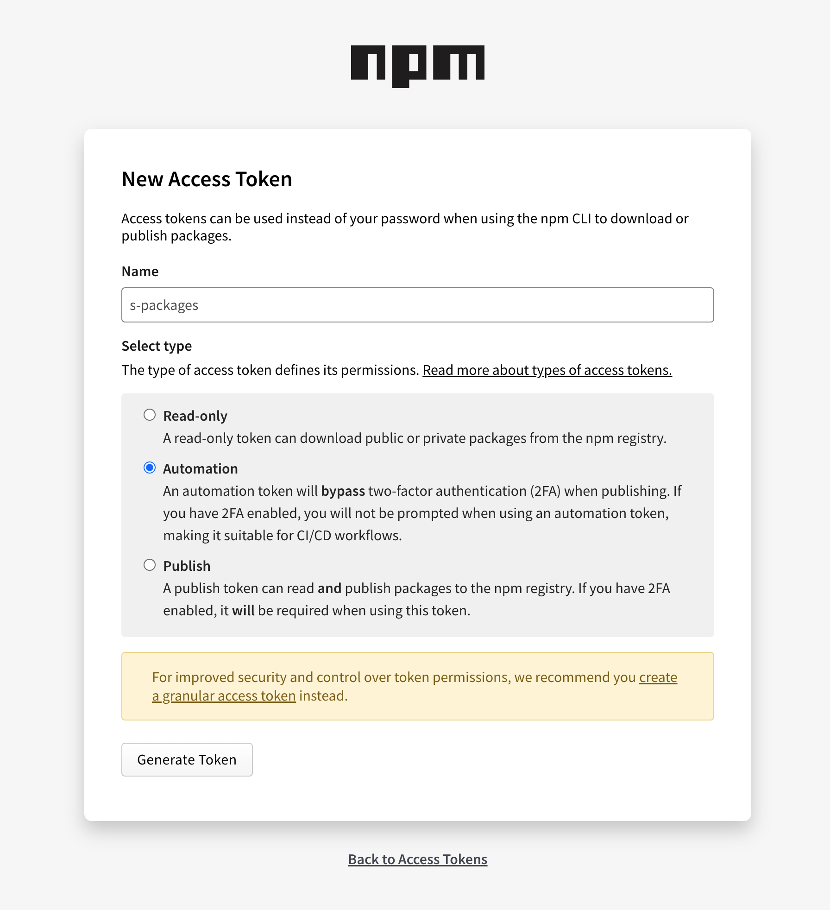
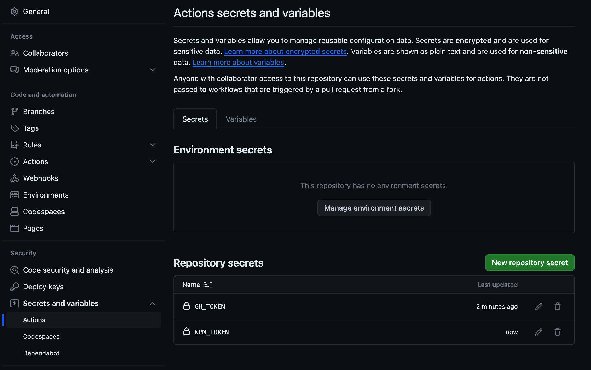
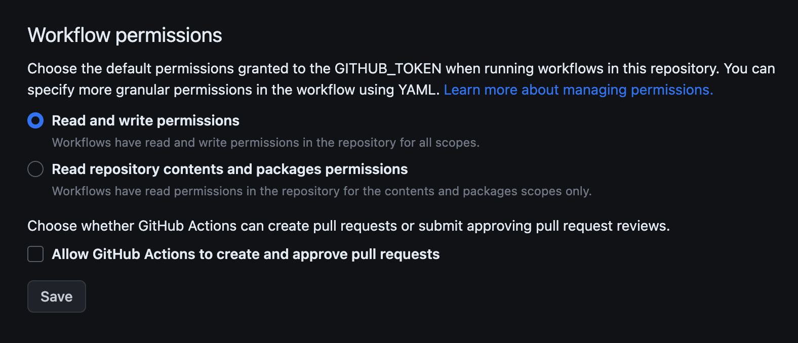

# Table of Contents

1. [Set up your repository](#set-up-your-repository)
  - [Replace Details in tools/customize.json](#replace-details-in-customizesh)
  - [Add Permissions and Run tools/customize.sh](#add-permissions-and-run-customizesh)

2. [Add Tokens for NPM and Github](#add-tokens-for-npm-and-github)
  - [Set GH_TOKEN](#set-gh_token)
  - [Add GH_TOKEN and NPM_TOKEN as Secrets](#add-gh_token-and-npm_token-as-secrets)

3. [Setup repository](#setup-repository)
  - [Adjust Workflow Permissions](#adjust-workflow-permissions)

4. [Before Final Publish](#before-final-publish)
  - [Remove Unnecessary Files](#remove-unnecessary-files)
  - [Add Permissions and Run tools/cleanCustomize.sh](#add-permissions-and-run-cleancustomizesh)

5. [WayToWrok](WayToWrok.md)
  - [How work with branch](#How-work-with-branch)

6. [known problems](knownProblem.md)


### Set up your repository

Replace variable in the `./tools/customize.json` script with your own details to personalize your new package:

```bash
FULL_NAME="John Smith"
GITHUB_USER="johnsmith"
REPO_NAME="my-cool-package"
NODE_VERSION="18.17.1"
NPM_USER="johnsmith"
```

or look on example in `./tools/customize.example.json`

Add permission to edit `chmod +x ./tools/customize.sh` and rund it `./tools/customize.sh`

### Add Tokens for NPM(**Automation**), Github

Add your npm token to your GitHub repository secrets as `NPM_TOKEN`, `GH_TOKEN` 

- Set `GH_TOKEN` - https://github.com/settings/tokens/new
- Set `NPM_TOKEN`, set automation type - https://www.npmjs.com/settings/PLACEHOLDER_NPM_USER/tokens/new
  
  

- in Repository secrets Add `GH_TOKEN` and `NPM_TOKEN` it on https://github.com/PLACEHOLDER_GITHUB_USER/PLACEHOLDER_REPO_NAME/settings/secrets/actions as new repo secret
  

### Setup repository

go to
https://github.com/PLACEHOLDER_GITHUB_USER/PLACEHOLDER_REPO_NAME/settings/actions - > Workflow permissions -> check
Read and write permissions



### Start publish

start publish from dev brnach !

### Before final publish

remove unnecessary files:


Add permission to edit `chmod +x ./tools/cleanCustomize.sh` and rund it `./tools/cleanCustomize.sh`
